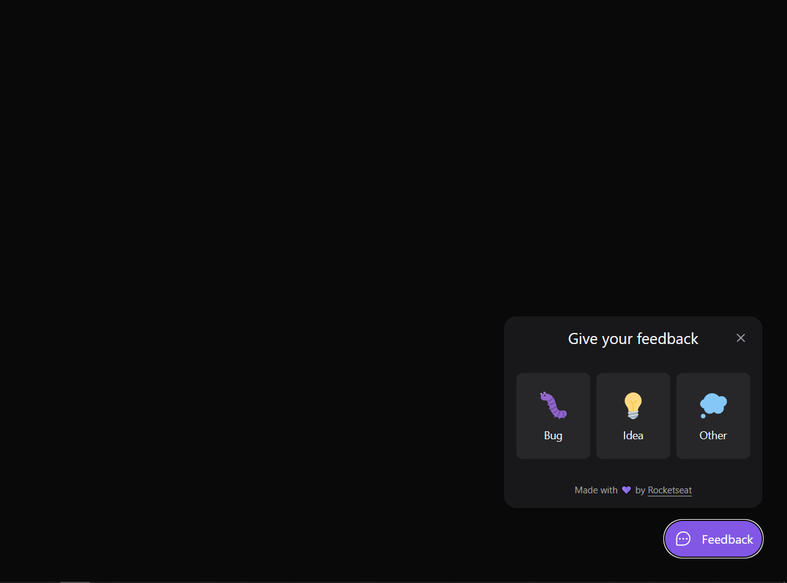

<div align="center">

# Feedback Widget

[](https://github.com/SlyCooper-n)
[](https://github.com/SlyCooper-n/feedback-widget-nlw-08/issues)
[](https://github.com/SlyCooper-n/feedback-widget-nlw-08/blob/main/LICENSE)

[](https://github.com/Rocketseat)

</div>

> Project made together with Rockeseat to practise Node.js, database and mobile.

<br />



## :pushpin: About

<<<<<<< HEAD
This project was developed together with [Rocketseat](https://github.com/Rocketseat), [Diego Fernandes](https://github.com/diego3g) and [Rodrigo](https://github.com/rodrigorgtic) in NLW #8 in order to practise web development using Node.js and Prisma to manage databases.
=======
This project was developed together with [Rocketseat](https://github.com/Rocketseat), [Diego Fernandes](https://github.com/diego3g) and [Rodrigo](https://github.com/) in NLW #6 in order to practise web development using Next.js and Firebase to provide real-time rooms. I'll be improving this project from now on to keep evolving my knowledge and maybe create something cool for people to use. Actually, I've made some small features on top of the boilerplate provided by the class, like PWA and dark mode support. But that's not all, I'm aiming to add [this feedback feature](https://github.com/SlyCooper-n/feedback-widget-nlw-08) inside this web app in the near future as well as CI with Github Actions.

> > > > > > > 057a4bf3a952b0888f0835627cdc6bd4a304879a
> > > > > > > about my dev journey, consider visiting my [LinkedIn](https://linkedin.com/in/gabriel-vs-frasao).

## :hammer: Main tools and libs used

<details>
<summary>
Base tools
</summary>

- [React](https://reactjs.org/)
- [React Native](https://reactnative.dev/)
- [Node.js](https://nodejs.org/en/)
- [TypeScript](https://www.typescriptlang.org/)
- [Prisma](https://www.prisma.io/)

</details>

<details>
<summary>
Linters and Formatters
</summary>

- [Prettier](https://prettier.io/)
- [.editorConfig](https://editorconfig.org/)

</details>

## :sparkles: Features

- [x] Send and receive feedbacks
- [x] Save feedbacks data on any database
- [x] Automatic email sending on new feedback

## :rocket: Running this project

**Clone on your machine** (I personally use Github CLI)

```bash
# by git
git clone https://github.com/SlyCooper-n/feedback-widget-nlw-08.git

# or by Github CLI
gh repo clone SlyCooper-n/feedback-widget-nlw-08
```

**Set every thing up**

```bash
# enter the project folder
cd feedback-widget-nlw-08

# install dependencies
npm install

# run on development mode
npm run dev
```

## :brain: Thinking of contributing to the project?

Clone the repo as shown above :arrow_up: and follow [this little guide](https://github.com/SlyCooper-n/feedback-widget-nlw-08/blob/main/_docs/CONTRIBUTING.md)

## :memo: License

[MIT License](https://github.com/SlyCooper-n/feedback-widget-nlw-08/blob/main/LICENSE) &copy; [Gabriel VS Frasão](https://github.com/SlyCooper-n)
